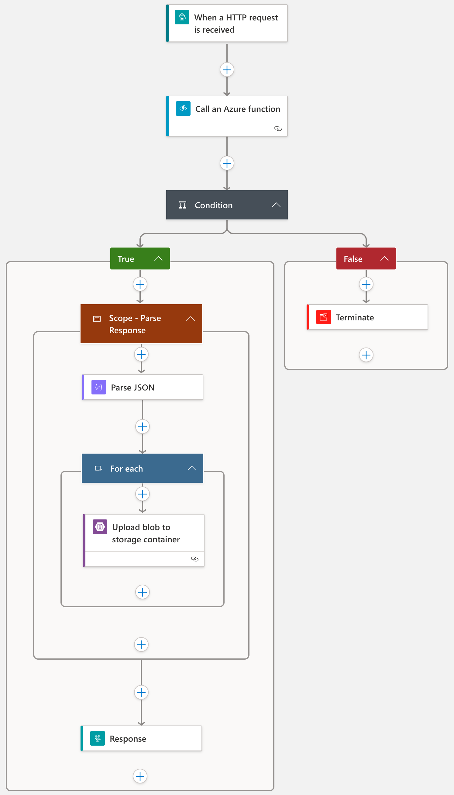

# Convert Excel to CSV with Azure Function

## Prerequisites

Prior Azure Function deployment, create following resources (login with `az login` first, if necessary):

1. Storage Account

````
az storage account create \
--name <STORAGE_NAME> \
--location <REGION> \
--resource-group <RESOURCE_GROUP> \
--sku Standard_LRS
````

2. Function App

````
az functionapp create \
--name <APP_NAME> \
--resource-group <RESOURCE_GROUP> \
--consumption-plan-location <REGION> \
--storage-account <STORAGE_NAME> \
--runtime dotnet \
--functions-version 4 
````

Afterwards, you need to checkout this repository and setup your local environment according to [documentation](https://learn.microsoft.com/en-us/azure/azure-functions/create-first-function-cli-csharp?tabs=azure-cli%2Cin-process#configure-your-local-environment)

## Deployment

To deploy Azure Function to Azure, run following command from local command line:

````
func azure functionapp publish <APP_NAME>
````

> NOTE: You need to be in `function-app` directory of this repository prior running this command.

## Development

To develop Azure Function in this project further, it is recommended to setup Visual Studio Code development environment according to [documentation](https://learn.microsoft.com/en-us/azure/azure-functions/functions-develop-vs-code?tabs=csharp).

## Logic App

Following is an example of logic app that is using Azure Function to convert Excel to CSV. It implements following workflow:

1. Receive an Excel file as body of HTTP request.
2. Call Azure Function and send received Excel file as body of HTTP request.
3. If response status of Azure Function is 200, continue, otherwise terminate logic app.
4. Parse response body from Azure Function and convert according to JSON schema (in order to reference elements in further steps). Response is an JSON array which contains `name` and `content` pairs with CSVs. Azure Function generates one CSV file per worksheet from Excel file.

Example response:

````json
[
	{
		"name": "First Sheet",
		"content": "Header1, Header2, ..."
	}, {
		"name": "Second Sheet",
		"content": "Cell1, Cell2, ..."
	}
]
````
5. Iterate over all CSVs returned from Azure Function and save each CSV as blob in Storage Account.
6. Return OK response to client.


Source code of this logic app is in [excel2csv.json](logic-app/excel2csv.json) file.

Logic app visualization:



# License

Distributed under [MIT license](LICENSE.md).